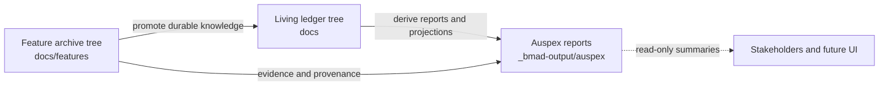

# Auspex User Guide

Auspex is the BMad governance module for keeping project knowledge trustworthy as features are delivered, promoted into living documentation, and summarized for stakeholders. It helps you answer three practical questions:

- Is our authored project knowledge internally consistent?
- Which completed feature knowledge should move into living service, domain, or program ledgers?
- What can stakeholders safely understand from the current state of the project?

Auspex is designed for BMad and LENS-style projects where feature history, living ledgers, and reporting views must stay connected without becoming the same thing.

## Core Idea

Auspex uses a two-tree knowledge model.



The feature archive is the permanent historical record of delivered work. Living ledgers are the current operational truth for services, domains, programs, and major shared capabilities. Reports and snapshots are generated views; they are useful for review and communication, but they are not source truth.

## How Auspex Integrates With BMad

Auspex is installed as a BMad module and follows the same module conventions as the rest of the workspace.

- Shared configuration is normally written to `_bmad/config.yaml`; workflows also read `_bmad/config.toml` when present.
- Personal settings are normally written to `_bmad/config.user.yaml`; workflows also read `_bmad/config.user.toml` when present.
- BMad help and menu discovery uses `_bmad/module-help.csv`.
- Auspex workflow skills live under `.agents/skills/ausx-*`.
- Auspex writes reports to `_bmad-output/auspex`.

The current Auspex configuration is:

| Setting | Value | Purpose |
| --- | --- | --- |
| `feature_archive_path` | `{project-root}/docs/features` | Permanent feature archive location. |
| `landscape_root` | `{project-root}/docs` | Living ledger and project knowledge root. |
| `reporting_output_path` | `{project-root}/_bmad-output/auspex` | Report and snapshot output directory. |
| `freshness_threshold_hours` | `24` | Age after which reports are marked stale. |

When a BMad agent runs an Auspex workflow, it loads these settings from BMad config, reads the relevant project documents, and writes its output using BMad's output folder conventions. This means Auspex can be used from normal BMad chat workflows without a separate CLI.

## Available Workflows

| Menu code | Workflow | Use it when | Default output |
| --- | --- | --- | --- |
| `AX` | Configure Auspex | You need to install, update, or repair Auspex config. | `_bmad/config.yaml`, `_bmad/config.user.yaml`, `_bmad/module-help.csv` |
| `MA` | Map audit | You need to validate stable IDs, parent references, links, or promotion readiness. | `map-audit-{date}.md` |
| `LP` | Ledger promotion | Completed feature knowledge needs to move into living ledgers. | `ledger-promotion-{scope}-{date}.md` |
| `SI` | Salmon impact | A downstream discovery may need to update upstream service, domain, or program truth. | `salmon-impact-{origin-or-date}.md` |
| `TD` | Topology design | You need to create or update program, domain, service, or ledger parentage decisions. | `topology-decision-{date}.md` |
| `RS` | Reporting snapshot | You need a read-only stakeholder status snapshot. | `snapshot-{date}.md` and `snapshot-{date}.json` |

## Quick Start

1. Confirm Auspex is configured.

   Ask the BMad agent:

   ```text
   configure Auspex
   ```

   Reconfiguration refreshes Auspex config and help entries using the module setup flow. If legacy Auspex or core config/package directories are present, setup may migrate matching values and remove those legacy files or directories after a successful merge. Review the confirmation summary if you still rely on legacy installer files.

2. Put completed feature knowledge under `docs/features`.

   A feature archive can contain Markdown and YAML-bearing files. Auspex gets the best results when files include stable metadata such as `stable_id`, `entity_type`, `title`, `belongs_to`, `status`, `updated_at`, `source_feature`, `promotion_status`, `salmon_upstream`, `links`, and `replaces`.

3. Keep living project knowledge under `docs`.

   A typical ledger layout is:

   ```text
   docs/<program>/<domain>/<service>/ledger/
   ```

   Shallower paths are acceptable when the project is smaller, but each governed entity should still have clear parentage and durable identity.

4. Run a map audit before major promotion or reporting work.

   ```text
   ausx map audit
   ```

   Use the report to clear blocking issues before relying on projections, promotions, or stakeholder summaries.

5. Promote completed feature knowledge into ledgers.

   ```text
   ausx ledger promotion for docs/features/<feature-id>
   ```

   By default, the workflow produces a promotion plan and report. To allow write-back to living ledgers, explicitly ask for apply behavior:

   ```text
   ausx ledger promotion for docs/features/<feature-id> --apply
   ```

6. Create a stakeholder snapshot.

   ```text
   ausx reporting snapshot --format markdown,json
   ```

   The snapshot is read-only and should be treated as a time-bound view, not as the source of project truth.

## Recommended Operating Cadence

Use this cadence when running Auspex across a normal BMad delivery cycle.

| Moment | Auspex action | Why it matters |
| --- | --- | --- |
| After completing a feature | Run ledger promotion in plan mode. | Identifies durable knowledge and target ledgers without changing files too early. |
| Before applying ledger changes | Run map audit. | Confirms stable IDs, parentage, and links are safe enough for promotion. |
| When downstream work changes upstream assumptions | Run Salmon impact review. | Prevents local discoveries from silently contradicting parent decisions. |
| When ownership or boundaries are unclear | Run topology design. | Records program, domain, service, and ledger placement decisions. |
| Before stakeholder review | Run reporting snapshot. | Produces a concise view of health, risks, freshness, and next actions. |

## Workflow Details

### Map Audit

Use map audit when you need confidence in the knowledge map before promotion, reporting, or projection rebuilds.

Example prompts:

```text
ausx map audit
ausx map audit docs --html
validate Auspex ledgers for docs/features/<feature-id>
```

The audit is read-only. It classifies findings as blocking or advisory. Blocking findings include duplicate stable IDs, missing stable IDs on governed entities, broken parent references, parentage cycles, invalid local links, and completed features whose ledger target cannot be resolved. Advisory findings include stale metadata, optional metadata gaps, missing breadcrumbs, and completed-but-unpromoted knowledge with a clear target.

The key field in the report is projection rebuild readiness. If it is false, clear the blocking findings before trusting generated projections or stakeholder summaries.

### Ledger Promotion

Use ledger promotion to move durable knowledge from completed feature archives into living ledgers while preserving provenance.

Example prompts:

```text
ausx ledger promotion for docs/features/<feature-id>
promote completed features to ledgers
ausx ledger promotion for docs/features/<feature-id> --apply
```

Without `--apply`, the workflow writes a plan and report only. With `--apply`, it may update ledger files under `landscape_root`, but it still must preserve `source_feature` or equivalent provenance. It should not flatten feature history into the ledger, and it should not rewrite feature archives except for a user-approved promotion marker.

If a promotion would change published topology, stop and run topology design or Salmon impact first.

### Salmon Impact Review

Use Salmon impact when a downstream feature, service note, or ledger entry suggests that upstream project truth may need to change.

Example prompts:

```text
ausx salmon impact for docs/features/<feature-id>
review upstream impact for docs/<program>/<domain>/<service>/ledger/<file>.md
trace recursive consistency from <artifact-path>
```

Auspex treats `salmon_upstream: true`, `impact: upstream`, `upstream_impact`, `UPSTREAM IMPACT`, and explicit user requests as upstream-impact signals. The review follows parent references toward service, domain, and program ledgers, then reports whether the issue is advisory refresh work or a blocking contradiction.

Salmon review does not silently change topology. If parentage, ownership, or stable identity must change, route the work to topology design.

### Topology Design

Use topology design when project structure itself needs to be decided, corrected, or documented.

Example prompts:

```text
ausx topology design for <scope>
design service topology for <domain-or-program>
update topology decision for <service-or-capability>
```

The output is a topology decision report covering hierarchy, stable IDs, parent references, ownership boundaries, ledger paths, assumptions, and projection rebuild guidance. It may propose ledger scaffolds, but it should only create or update ledger files when you explicitly approve that behavior.

### Reporting Snapshot

Use reporting snapshot when you need a human-readable and machine-readable status view for stakeholders.

Example prompts:

```text
ausx reporting snapshot
create Auspex snapshot for executive stakeholders
stakeholder status report --format markdown,json
```

Snapshots include overall status, blocking risks, advisory findings, completed features, unpromoted knowledge, ledger health, topology health, Salmon impact status, freshness, and recommended next actions. Snapshot JSON is intended to be stable enough for future Auspex UI ingestion.

## Understanding Report Status

Auspex reports separate blocking issues from advisory issues.

- Blocking means the project should not publish, promote, or rebuild projections from the affected knowledge until the issue is resolved or explicitly accepted. A summary may still be used as a risk report if it preserves the blocking/advisory distinction.
- Advisory means the project can usually continue, but the cleanup should be tracked.
- Stale means the report or source artifact is older than the configured freshness threshold.
- Unknown means Auspex could not prove a claim from available metadata and did not guess.

Common report verdicts include:

| Workflow | Verdicts |
| --- | --- |
| Map audit | `PASS`, `PASS_WITH_ADVISORIES`, `BLOCKED` |
| Ledger promotion | `APPLIED`, `PLANNED`, `PARTIAL`, `BLOCKED` |
| Salmon impact | `NO_UPSTREAM_CHANGE`, `ADVISORY_REFRESH`, `BLOCKING_CONTRADICTION`, `TOPOLOGY_REVIEW_REQUIRED` |
| Topology design | `PROPOSED`, `APPROVED`, `APPLIED`, `BLOCKED` |
| Reporting snapshot | `GREEN`, `YELLOW`, `RED` |

## Preparing Good Source Artifacts

Auspex works best when project documents include stable, explicit metadata. A governed Markdown artifact can use frontmatter like this:

```yaml
---
stable_id: service.billing.invoice-api
entity_type: service
title: Invoice API
belongs_to: domain.billing
status: active
updated_at: 2026-05-20T20:30:00Z
source_feature: docs/features/invoice-api-launch
links:
  - ../ledger/billing-domain.md
---
```

Use stable IDs that survive file moves. Use `belongs_to` for parent relationships. Add `source_feature` when ledger knowledge came from a feature archive. Mark upstream-impact discoveries explicitly so Salmon review can find them.

## Safety Rules for End Users

- Treat feature archives as historical records. Do not overwrite delivery history just to make a ledger look clean.
- Treat ledgers as living truth. Promote durable knowledge there when it affects current operations or decisions.
- Treat Auspex reports as generated evidence. Use them for review, but do not make them the only source of truth.
- Use `--apply` only when you are ready for the workflow to write approved ledger updates or topology scaffolds under `landscape_root`; otherwise keep workflows in report or plan mode.
- Run map audit before broad promotion, topology changes, or stakeholder reporting.
- Preserve provenance with `source_feature` or an equivalent breadcrumb whenever knowledge moves from a feature archive into a ledger.

## Troubleshooting

| Symptom | Likely cause | What to do |
| --- | --- | --- |
| Auspex says config is missing. | No `ausx` or `modules.ausx` section was found in the supported BMad config files (`_bmad/config.yaml`, `_bmad/config.user.yaml`, `_bmad/config.toml`, or `_bmad/config.user.toml`). | Run `configure Auspex`. |
| Audit reports many unknown entities. | Source files lack stable IDs, entity types, or parent references. | Add frontmatter metadata to governed artifacts. |
| Promotion is blocked. | The feature lacks a stable ID, target ledger, or clear source of truth. | Run map audit, then topology design if parentage is unclear. |
| Snapshot is yellow or red. | Recent audit, promotion, Salmon, or topology reports contain advisory or blocking findings. | Open the referenced reports in `_bmad-output/auspex` and address the highest-severity findings first. |
| Reports are marked stale. | The latest relevant report is older than `freshness_threshold_hours`. | Rerun the workflow that produced the stale report. |

## Where to Look

- Configuration: `_bmad/config.yaml`
- Personal BMad settings: `_bmad/config.user.yaml`
- BMad help registry: `_bmad/module-help.csv`
- Feature archives: `docs/features`
- Living ledgers and project knowledge: `docs`
- Auspex reports and snapshots: `_bmad-output/auspex`
