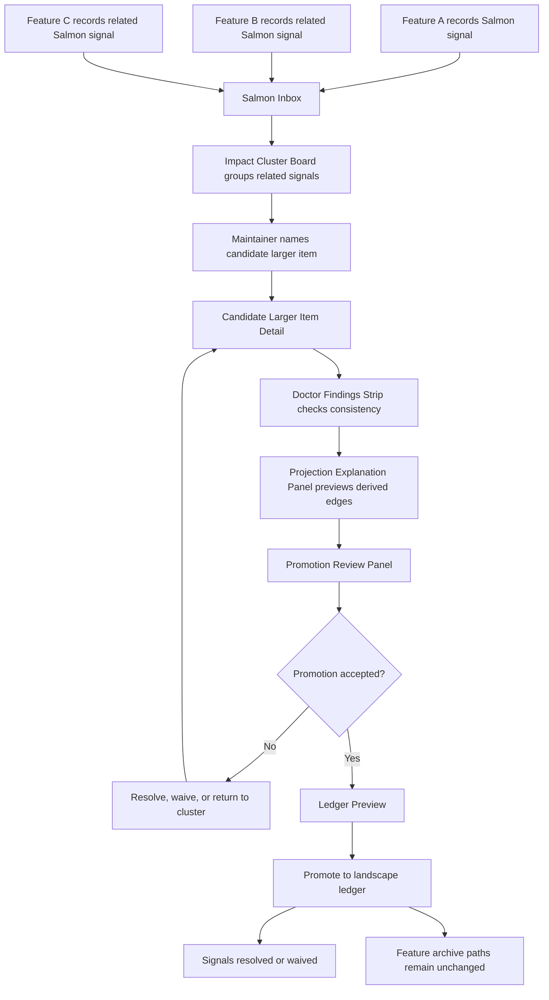
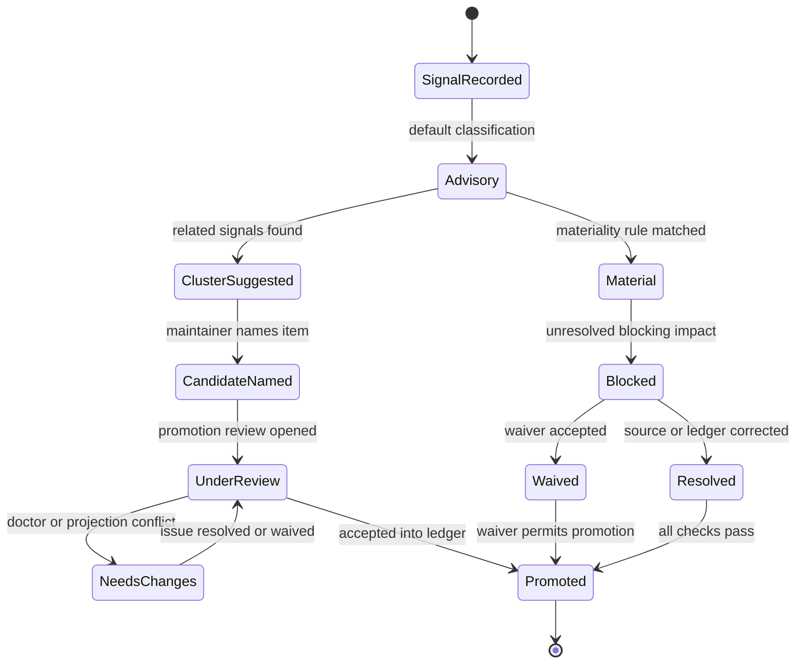

# UX Design Specification: Salmon Signal Rollup

## 1. Experience Summary

The Salmon Signal Rollup experience helps Lens maintainers and planning agents see when several feature-local upstream-impact notes are no longer isolated notes. The workflow turns related Salmon signals into a visible cluster, lets a maintainer name and review a candidate larger item, verifies consistency with doctor checks, previews the derived projection edges, and promotes the accepted item into a service, domain, or program ledger.

The experience is operational rather than promotional. It is a workbench flow for people who maintain planning truth: they need traceability, low ceremony, clear blocking rules, and confidence that feature archive records remain stable. The design keeps feature folders under `docs/features/<feature_id>` as permanent facts and treats landscape ledgers as the place where reusable service, domain, or program knowledge accumulates.

Salmon signals start advisory by default. They become material or blocking only when the evidence meets policy: contradiction with published ledger truth, broken stable identity or parent resolution, lifecycle-critical assumption failure, or implementation-critical dependency, security, or API inconsistency. The UI keeps this distinction visible so maintainers do not treat every upstream note as a stop sign.

Auspex and reporting surfaces are downstream consumers only. They may read the resulting projection and ledger state, but they do not author, promote, or define Salmon rollup truth.

## 2. Users and Jobs

Primary users:

- Lens maintainer: reviews signals, names candidate larger items, resolves conflicts, and promotes accepted knowledge into ledgers.
- Planning conductor: needs phase-aware warnings and blockers before delegating planning work.
- Downstream BMAD delegate: needs reliable predecessor, sibling, and upstream-impact context without inferring from paths.
- Governance reviewer: checks whether the promotion, waiver, or projection output is traceable and boundary-safe.

Secondary users:

- Architect or developer delegate: consumes resolved signal context during TechPlan, FinalizePlan, Dev, and Complete.
- Reporting consumer: reads projection output after promotion, with no authority to mutate source truth.

Core jobs:

- Notice that multiple features are raising related upstream impacts.
- Separate advisory signal noise from material signal risk.
- Review why a set of signals belongs together.
- Name a candidate larger item without moving feature archives.
- Validate candidate consistency before promotion.
- Promote durable knowledge into one selected landscape ledger.
- Explain all derived relationships back to source stable IDs and paths.

## 3. Core UX Model

The UX is built around four source-of-truth ideas:

- Feature records are permanent facts under `docs/features/`.
- Salmon signals are reviewable impact notes attached to feature or ledger records.
- Signal clusters are workbench candidates, not ledger truth.
- Ledgers are promoted landscape knowledge; the projection map is a derived cache.

The main objects shown in the interface are:

- Feature: a stable delivery record such as `feature:feature-a`.
- Salmon signal: an upstream-impact entry with target stable ID, category, materiality, status, source, and review metadata.
- Cluster: a suggested group of related Salmon signals based on target, category, affected IDs, repeated evidence, and lifecycle risk.
- Candidate larger item: a maintainer-named workbench object prepared for promotion.
- Ledger entry: the accepted service, domain, or program knowledge item that links back to features and signals.
- Projection edge: a derived relationship such as feature-to-ledger membership, parent edge, related impact edge, or promotion evidence edge.

Status vocabulary:

- Advisory: informational impact; does not block by default.
- Material: likely lifecycle or landscape impact; requires explicit review before phase completion if policy says so.
- Blocked: material impact currently blocks promotion, publication, or phase advancement.
- Waived: reviewed impact is allowed to proceed with owner, reason, affected IDs, and review point.
- Resolved: impact has been addressed by metadata, ledger update, implementation change, or accepted promotion.

The UI must always pair status color with text, icon, and short reason. Color alone is never the only status carrier.

## 4. Primary Journey: Feature Signals Become a Larger Item

Walkthrough narrative:

1. Feature A records an advisory Salmon signal that its stable ID and `belongs_to` policy may affect the topology doctor.
2. Feature B records a Salmon signal against the same service-level area because projection rebuild explains similar parent and child edges.
3. Feature C records a Salmon signal that mentions durable ledger promotion for the same landscape concern.
4. The Salmon Inbox groups the three signals as related and displays a cluster confidence explanation.
5. The maintainer opens the Impact Cluster Board and sees that Feature A, Feature B, and Feature C share affected stable IDs, impact category, and review language.
6. The maintainer names the candidate larger item, for example `service-ledger-promotion-discipline`, and chooses the pilot ledger type to evaluate.
7. The Candidate Larger Item Detail shows source paths, statuses, proposed summary, linked features, unresolved questions, and proposed ledger placement.
8. The Doctor Findings Strip runs read-only checks for duplicate IDs, unresolved parents, projection drift, unchecked material signals, and promotion conflicts.
9. The Projection Explanation Panel previews the new derived edges and states that the projection remains a cache.
10. The maintainer opens the Promotion Review Panel, resolves or waives material issues, and accepts the candidate.
11. The Ledger Preview shows the exact ledger entry that will be created or updated through the approved promotion boundary.
12. The maintainer promotes the larger item into the selected landscape ledger.
13. Feature A, Feature B, and Feature C remain in their original `docs/features/` archive paths. Their Salmon signals now link to the promoted ledger entry and are marked resolved or waived as appropriate.

State model:

## 5. Screen and Panel Design

### Feature Signal Drawer

Purpose: capture and inspect Salmon signals from a feature record without implying that the feature moves.

Key content:

- Feature stable ID, title, phase, track, and permanent docs path.
- Signal list grouped by target stable ID and status.
- Add signal form with target stable ID, impact category, summary, materiality, status, owner, and review point.
- Archive permanence note: `Feature path remains docs/features/<feature_id>`.
- Links to projection explanation for affected relationships.

Primary actions:

- Add advisory signal.
- Mark material.
- Request review.
- Open in Salmon Inbox.

### Salmon Inbox

Purpose: triage all open Salmon signals across current planning scope.

Key content:

- Filter tabs: All, Advisory, Material, Blocked, Waived, Resolved.
- Sort controls: newest, severity, target stable ID, cluster confidence, phase risk.
- Signal rows with source feature, target stable ID, status, category, materiality reason, and last review timestamp.
- Cluster suggestions shown as grouped rows with explanation badges.
- Doctor summary for unchecked material signals.

Primary actions:

- Open cluster.
- Assign reviewer.
- Mark checked.
- Create candidate larger item from selected signals.

### Impact Cluster Board

Purpose: show why signals are related and whether they should become a candidate larger item.

Key content:

- Columns: New suggestions, Needs review, Candidate ready, Returned.
- Cluster cards with involved features, target stable IDs, shared categories, confidence reason, and highest status.
- Evidence list showing matching terms, shared parent references, shared ledger targets, and repeated doctor findings.
- Split and merge controls for correcting clustering suggestions.

Primary actions:

- Accept cluster.
- Split cluster.
- Merge with another cluster.
- Name candidate larger item.

### Candidate Larger Item Detail

Purpose: prepare a cluster for promotion while preserving source traceability.

Key content:

- Candidate name, stable ID proposal, description, owner, and proposed ledger type.
- Linked feature signals from Feature A, Feature B, and Feature C.
- Source paths for each feature record.
- Proposed ledger summary and durable knowledge statement.
- Status distribution across advisory, material, blocked, waived, and resolved signals.
- Open questions and required decisions.

Primary actions:

- Edit candidate name.
- Change proposed ledger type.
- Run doctor checks.
- Preview projection edges.
- Open promotion review.

### Promotion Review Panel

Purpose: make the accept, reject, waive, or return decision explicit and auditable.

Key content:

- Review checklist: source traceability, materiality review, waiver completeness, doctor status, projection preview, ledger steward acceptance.
- Blocking findings with required resolution.
- Waiver editor requiring owner, rationale, affected stable IDs, expiry or review point, and impacted gate.
- Decision log with reviewer, timestamp, and outcome.

Primary actions:

- Accept for promotion.
- Return for changes.
- Record waiver.
- Reject candidate.

### Ledger Preview

Purpose: show exactly what the promoted larger item will add to the selected landscape ledger.

Key content:

- Target ledger stable ID, type, title, current publication state, and steward.
- Proposed entry title, summary, linked feature IDs, signal IDs, promotion rationale, and status.
- Difference view between current ledger content and proposed addition.
- Reminder that the ledger is source truth and the projection map is derived after approved publication or rebuild.

Primary actions:

- Confirm promotion.
- Copy stable ID proposal into candidate details.
- Return to review.

### Projection Explanation Panel

Purpose: explain relationships without letting users hand-edit the derived map.

Key content:

- Source metadata used for each proposed entity and edge.
- Parent, child, feature-to-ledger, and impact edges that would appear after promotion.
- Cache status: current, stale, or not generated.
- Explanation that projection output is a derived cache and must be rebuilt by approved commands.

Primary actions:

- Explain by stable ID.
- Show source paths.
- Run check mode if available.
- Open doctor findings.

### Doctor Findings Strip

Purpose: keep consistency risk visible across inbox, cluster, detail, and review screens.

Key content:

- Compact finding chips: Info, Warning, Blocker.
- Finding codes for duplicate stable ID, unresolved parent, projection drift, unchecked material Salmon, promotion conflict, and waiver missing review point.
- Count by severity and affected stable IDs.
- Phase relevance label, for example `BusinessPlan warning` or `FinalizePlan blocker`.

Primary actions:

- Expand findings.
- Jump to affected signal.
- Run read-only doctor check.
- Attach finding to promotion review.

## 6. Interaction Details

Signal creation:

- Default new signals to Advisory unless the user selects a materiality reason.
- Require a target stable ID or explicit `unknown target` only during early planning.
- Require category, summary, and source feature ID before save.
- Show a phase-aware warning if the target is unresolved or outside known projection data.

Signal triage:

- Selecting multiple signals enables `Create candidate larger item` only when each signal has a source feature and target reference.
- Material signals require reviewer assignment before they can be marked checked.
- Blocked signals keep primary promotion actions disabled until resolved or waived.
- Waived signals remain visible and must show owner, rationale, affected IDs, and review point.

Cluster correction:

- Maintainers can split a cluster when the system over-groups unrelated signals.
- Maintainers can merge clusters when two groups share a target stable ID or materiality reason.
- Every split or merge records a short reason for auditability.
- Candidate names are human-maintained; the system may suggest names but must not silently promote them.

Promotion:

- Promotion is explicit and review-gated.
- Ledger selection must happen before final confirmation.
- Projection preview is required before promotion confirmation.
- The UI must state that feature archive paths remain unchanged after promotion.

## 7. Signal Clustering Rules Shown in the UI

The UI should expose clustering as an explanation, not as a hidden truth. Each cluster card shows the top reasons it exists.

Suggested grouping signals:

- Same target stable ID.
- Same parent ledger or `belongs_to` area.
- Same impact category such as topology, API, security, dependency, lifecycle, or promotion.
- Same doctor finding code.
- Same materiality reason.
- Repeated language in summaries or accepted promotion notes.
- Cross-links through `related_to`, `depends_on`, or projection membership.

Cluster confidence labels:

- Strong: same target stable ID plus same impact category across two or more features.
- Medium: shared parent or doctor finding, but different direct targets.
- Weak: text similarity or adjacency only; needs maintainer confirmation.

Materiality labels:

- Advisory: useful context, no blocking reason found.
- Material: likely affects ledger truth, parent resolution, lifecycle assumptions, or implementation-critical dependencies.
- Blocked: material issue currently prevents promotion, publication, or configured phase advancement.
- Waived: material issue accepted with owner, rationale, affected IDs, and review point.
- Resolved: impact addressed and linked to evidence.

The UI must let maintainers override cluster membership, but not erase source signal history. Corrections adjust the workbench cluster while the original feature-local signal remains traceable.

## 8. Promotion Review Flow

Promotion review turns a candidate larger item into ledger truth.

Review stages:

1. Source check: every signal links to a source feature, source path, target stable ID, and review status.
2. Materiality check: material and blocked signals are resolved or have complete waivers.
3. Candidate check: the candidate has a name, owner, summary, and selected ledger type.
4. Doctor check: read-only findings are reviewed and no unwaived blockers remain.
5. Projection check: previewed edges explain the derived relationships and source metadata.
6. Steward check: the owner or maintainer accepts the entry into the selected service, domain, or program ledger.
7. Promotion: the item becomes a ledger entry through an approved write boundary.

Promotion outcomes:

- Accepted: ledger entry is created or updated; related signals become resolved or waived.
- Returned: candidate remains open with required changes.
- Rejected: candidate is closed with reason; source signals remain in their current state.
- Deferred: candidate remains open with review point and owner.

Ledger promotion must not move Feature A, Feature B, Feature C, or any other feature archive. The ledger stores durable knowledge and links back to the feature facts.

## 9. Empty, Loading, Error, and Conflict States

Empty states:

- Feature Signal Drawer: `No Salmon signals recorded for this feature.` Include an Add signal action.
- Salmon Inbox: `No open Salmon signals in this scope.` Include filters and a link to explain where signals appear.
- Impact Cluster Board: `No cluster suggestions yet.` Include a prompt to select two or more related signals.
- Candidate Larger Item Detail: `Select or create a candidate to review.`
- Ledger Preview: `Choose a target ledger to preview promotion.`

Loading states:

- Use skeleton rows for signal lists and cluster cards.
- Show `Running read-only doctor checks` in the Doctor Findings Strip.
- Show `Building projection preview from source metadata` in the Projection Explanation Panel.
- Preserve previous results until new results arrive, clearly marked as stale when needed.

Error states:

- Missing source path: block promotion and link to the affected signal.
- Unknown target stable ID: warn during BusinessPlan; require resolution or waiver before configured blocking phases.
- Projection unavailable: allow review to continue, but require preview before promotion.
- Doctor command failed: show command status, last successful check, and retry action.
- Invalid waiver: block acceptance until owner, rationale, affected IDs, and review point are present.

Conflict states:

- Duplicate stable ID: blocker until corrected.
- Cluster contains unrelated targets: ask maintainer to split or justify merge.
- Ledger steward rejects placement: return candidate to review with reason.
- Projection preview disagrees with source metadata: block promotion until drift is resolved.
- Another user changed candidate review state: show conflict banner, preserve unsaved edits, and require refresh or merge.

## 10. UX Consistency Patterns

Use the same status language everywhere: Advisory, Material, Blocked, Waived, Resolved.

Use the same object order everywhere:

1. Source feature.
2. Signal.
3. Cluster.
4. Candidate larger item.
5. Ledger entry.
6. Projection edge.

Use the same safety reminders at promotion points:

- `Feature archive paths remain unchanged.`
- `Ledgers store promoted landscape knowledge.`
- `Projection maps are derived caches.`

Use operational labels rather than marketing labels. Prefer `Run doctor check`, `Preview projection edges`, `Record waiver`, and `Promote to ledger`.

Avoid turning reporting into the authoring surface. Reporting may show promoted outcomes after the fact, but the workbench flow owns review and promotion.

## 11. Responsive Design and Accessibility

Responsive behavior:

- Desktop: three-pane workbench with Inbox or Board on the left, Detail in the center, and Doctor or Projection panel on the right.
- Tablet: two-pane layout with selectable side panels.
- Mobile or narrow width: single-column stack with sticky status summary and panel switcher.
- Cluster cards keep stable height for status rows so loading, hover, and count changes do not shift layout.

Keyboard navigation:

- All panels must be reachable by Tab and Shift+Tab.
- Cluster cards support Enter to open, Space to select, and arrow keys within board columns.
- Promotion review checklist supports keyboard toggling and visible focus outlines.
- Modal or drawer focus is trapped until closed, with Escape returning focus to the invoking control.

Graph and relationship accessibility:

- Relationship visuals must have a text table alternative listing source ID, target ID, edge type, status, and source path.
- Projection Explanation Panel includes a screen-reader summary such as `Three features link to one candidate service ledger item through advisory and material Salmon signals.`
- Edge colors are paired with line style, icon, and label.
- Users can switch graph views to list view without losing actions.

Status accessibility:

- Advisory: blue or neutral indicator plus `Advisory` label and info icon.
- Material: amber indicator plus `Material` label and review icon.
- Blocked: red indicator plus `Blocked` label and stop icon.
- Waived: gray or outlined indicator plus `Waived` label and waiver icon.
- Resolved: green indicator plus `Resolved` label and check icon.
- Color contrast must meet WCAG AA for text, icons, focus outlines, and status chips.

Screen-reader requirements:

- Each signal row announces source feature, target stable ID, status, category, and materiality reason.
- Cluster cards announce number of features, number of signals, highest severity, and confidence label.
- Promotion confirmation announces the target ledger and states that feature archive paths remain unchanged.
- Doctor Findings Strip announces new blocker counts when checks complete.

## 12. Acceptance Criteria

AC-1. Given Feature A, Feature B, and Feature C each record related Salmon signals, when a maintainer opens the Salmon Inbox, then the UI shows the signals with source feature, target stable ID, status, category, and review state.

AC-2. Given related signals share target stable ID or impact category, when clustering runs, then the Impact Cluster Board groups them and explains the grouping reason and confidence level.

AC-3. Given a maintainer accepts a cluster, when they name a candidate larger item, then Candidate Larger Item Detail shows linked features, source paths, proposed ledger type, status distribution, and open review tasks.

AC-4. Given any signal is blocked, when the maintainer opens Promotion Review Panel, then promotion actions are disabled until the signal is resolved or a complete waiver is recorded.

AC-5. Given a signal is waived, when it appears anywhere in the workflow, then the UI shows owner, rationale, affected stable IDs, and review point.

AC-6. Given doctor checks find duplicate stable IDs, projection drift, or unchecked material Salmon, when the Doctor Findings Strip updates, then blockers are visible on Inbox, Detail, and Promotion Review screens.

AC-7. Given a candidate larger item is ready for promotion, when the maintainer opens Ledger Preview, then the UI shows the exact ledger addition or update and the linked source feature IDs.

AC-8. Given the maintainer confirms promotion, when the item is accepted into a landscape ledger, then Feature A, Feature B, and Feature C remain at their original `docs/features/` paths.

AC-9. Given the projection preview is opened, when relationships are displayed, then each edge can be explained by source stable ID and source path and is labeled as derived cache output.

AC-10. Given a reporting consumer reads the promoted outcome, when it displays topology or impact, then it consumes ledger and projection outputs downstream and does not become an authoring authority.

AC-11. Given a user cannot rely on color, when reviewing signal status, then text label, icon, and reason communicate Advisory, Material, Blocked, Waived, or Resolved.

AC-12. Given a screen-reader user opens the cluster or projection view, when focus lands on the visual relationship area, then a complete text summary and table alternative are available.

## 13. Handoff Notes

- Keep Salmon advisory by default until materiality policy is made explicit.
- Treat clustering as a maintained workbench suggestion, not a source-of-truth record.
- Promotion creates or updates landscape ledger knowledge; it does not move feature archive records.
- The first pilot should prove one ledger type before expanding to mature service, domain, and program hierarchy.
- Doctor and projection surfaces need clear status contracts before implementation so warnings and blockers do not become subjective negotiation.
- Projection explanation is required before promotion because the derived cache/source boundary is central to user trust.
- Auspex and stakeholder reporting should consume the resulting projection context only after promotion and rebuild.